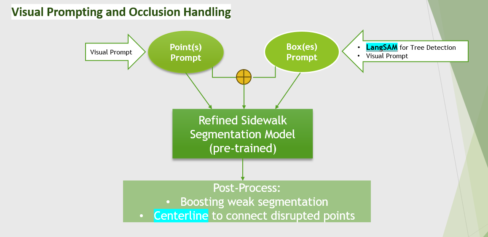

M5: Visual Prompting and Occlusion Handling

by Jinglin Tao (jt4296) and Grace Chen (fc2286)

Overall framework: 

  •	Refined sidewalk segmentation model (pre-trained in M3)

     o	Inference: Points Prompt

     o	Inference: Box Prompt

  •	LangSam

  •	Centerline

Implementation Environment: Google Colab

Source Data: Sidewalk train and validation data streamed from Huggingface

Workflow:

 
Our workflow for visual prompting and occlusion handling is summarized as above:

•	We started with refined sidewalk segmentation model pre-trained in Milestone 3, experimenting Point(s) prompt, Box(ex) prompt and a combination of the two

    o	Visual Prompt: 

    o	LangSAM to obtain BBOX for “tree”

•	Given that we did not get satisfactory results from just applying prompts, we attempted the following “stitching” approach:

      o	Boosting weak segmentation: we observed that the occluded area usually has some weak segmentation, meaning that their prediction probability is much lower than the threshold to be considered as sidewalk. Therefore we apply a certain threshold to filter out those weak segmentation and boost its probability to a level can be considered as sidewalk in a mask

      o	 Centerline: we attempted “Centerline” with an aim to connect the disrupted points around a tree occlusion. However given the noises, we obtained zig-zag lines (or could be there are two sidewalks and connection mistakenly went to the other sidewalk instead the disrupted point on the same sidewalk).

Findings:

•	Points prompt (a few on the occulted area and a few on the sidewalk) can sometimes help to generate predictions on the occulted area. However the outcomes are very random (differ from image to image and also a lot of times is very arbitrary based on points selection) and unstable

•	Boxes prompt by itself does not help to generate “sidewalk” prediction for occulted area in our experiments

•	A combination of points and boxes prompt can also help a little to generate “sidewalk” prediction for occulated area. However, its outcome also appears to be random and unstable

•	We failed to get good results from leveraging “Centerline” framework to connect the disrupted points from occluded area as the centerline plotting was heavily impacted by noises or detections from other sidewalk

•	We achieve improved results by boosting weak segmentation area. This is done by:

    o	Use LangSAM to predict bbox of “tree” area (in many cases LangSAM doesn’t have good segmentation results for our image dataset; we think it is related to the fact that image resolution is poor and also the entire image has a red tune including the trees)

    o	When LangSAM fails to predict the “tree”, we manually draw the bbox area via the GUI developed (which can generates points arrays from user clicked points and also generate bbox based on user dragged area). 

    o	In the focused area, we apply a threshold, for example [0.1,0.5], to the segmentation probability to filter out those weak segmentation and set it to be a higher value so that those weak segmentation can be boosted and show up in the final sidewalk mask prediction. 

Follow up work:

1.	Further training the refined sidewalk segmentation model. We believe that a better trained model may be able to improve the visual prompting and occlusion handling outcome.

2.	Our sidewalk_prompter can allow user to input one box. Should time allow, we want to further improve the code so that user can input multiple boxes (as there can be multiple occlusion areas in one image)
